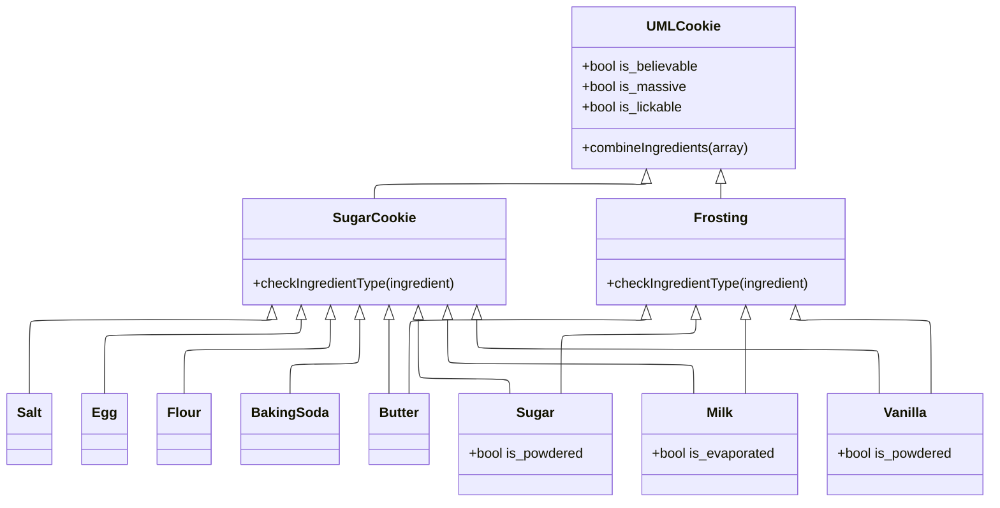
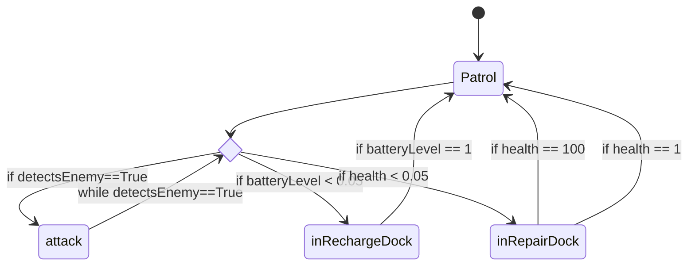

# Homework 1

## Part 1: Class Diagram

```mermaid
---
config:
 layout: elk
 hideEmptyMemberBox: true
---
classDiagram
	class UML Cookie
	class Sugar Cookie
	class Frosting
	class Salt
	class Egg
	class Flour
	class Baking Soda
	class Butter
	class Sugar
	class Milk
	class Vanilla
	UML Cookie <|-- Sugar Cookie
	UML Cookie <|-- Frosting
	Sugar Cookie <|-- Salt
	Sugar Cookie <|-- Egg
	Sugar Cookie <|-- Flour
	Sugar Cookie <|-- Baking Soda
	Sugar Cookie <|-- Butter
	Sugar Cookie <|-- Sugar
	Sugar Cookie <|-- Milk
	Sugar Cookie <|-- Vanilla
	Frosting <|-- Sugar
	Frosting <|-- Vanilla
	Frosting <|-- Butter
	Frosting <|-- Milk
	UML Cookie : +bool is_believable
	UML Cookie : +bool is_massive
	UML Cookie : +bool is_lickable
	UML Cookie : +combineIngredients(array)
	Sugar Cookie : +checkIngredientType(ingredient)
	Frosting : +checkIngredientType(ingredient)
	Sugar : +bool is_powdered
	Milk : +bool is_evaporated
	Vanilla : +bool is_powdered
	
	
```
## Part 2: State Diagram

```mermaid
stateDiagram-v2
	[*] --> Patrol
	state if_state <<choice>>
	Patrol --> if_state
	if_state --> attack: if detectsEnemy==True
	attack --> if_state: while detectsEnemy==True
	if_state --> inRechargeDock: if batteryLevel < 0.05
	inRechargeDock --> Patrol: if batteryLevel == 1
	if_state --> inRepairDock: if health < 0.05
	inRepairDock --> Patrol: if health == 100	
	inRepairDock --> Patrol: if health == 1
```
