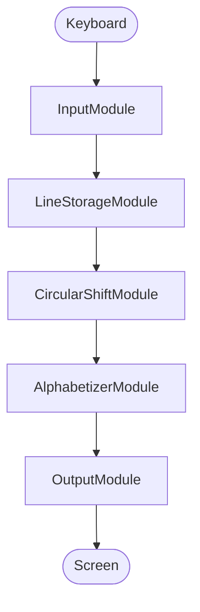

# KWIC Index System

Overview

This is an implementation of the KWIC Index System.

## Implementation Requirements

- Reads all lines from the keyboard
- Stores all the lines in the core with each word stored as a sequence of characters
- Circularly shifts all the lines and stores them
- Alphabetizes the circularly shifted lines
- Displays the results on the screen

## Modular Architecture

The system is comprised of 5 independent modules plus a main method:

### InputModule.java

- **Responsibility**: Reading lines from keyboard input
- **Interface**:
  - `readLines()`: Returns list of input lines
- **Information Hidden**: How input is obtained, input validation logic

### LineStorageModule.java

- **Responsibility**: Storing original lines
- **Interface**:
  - `storeLine(String)`: Store a single line
  - `storeLines(List<String>)`: Store multiple lines
  - `getLine(int)`: Retrieve line by index
  - `getLineCount()`: Get number of stored lines
- **Information Hidden**: Internal data structure (ArrayList), storage mechanism

### CircularShiftModule.java

- **Responsibility**: Generating and storing circular shifts
- **Interface**:
  - `generateShifts(LineStorageModule)`: Generate all shifts
  - `getShiftedLine(int)`: Retrieve shifted line by index
  - `getShiftedLineCount()`: Get number of shifts
- **Information Hidden**: Shift generation algorithm, shift storage structure

### AlphabetizerModule.java

- **Responsibility**: Sorting shifted lines alphabetically
- **Interface**:
  - `alphabetize(CircularShiftModule)`: Sort the shifted lines
  - `getSortedLine(int)`: Retrieve sorted line by index
  - `getSortedLineCount()`: Get number of sorted lines
- **Information Hidden**: Sorting algorithm (uses Collections.sort), case-sensitivity handling

### OutputModule.java

- **Responsibility**: Displaying results to screen
- **Interface**:
  - `displayResults(AlphabetizerModule)`: Display all sorted lines
- **Information Hidden**: Output formatting, display medium details

### Main.java

- **Responsibility**: Coordinating all modules in the correct sequence
- **Flow**: Input → Storage → Shift → Alphabetize → Output

## Flow Chart



```

```
